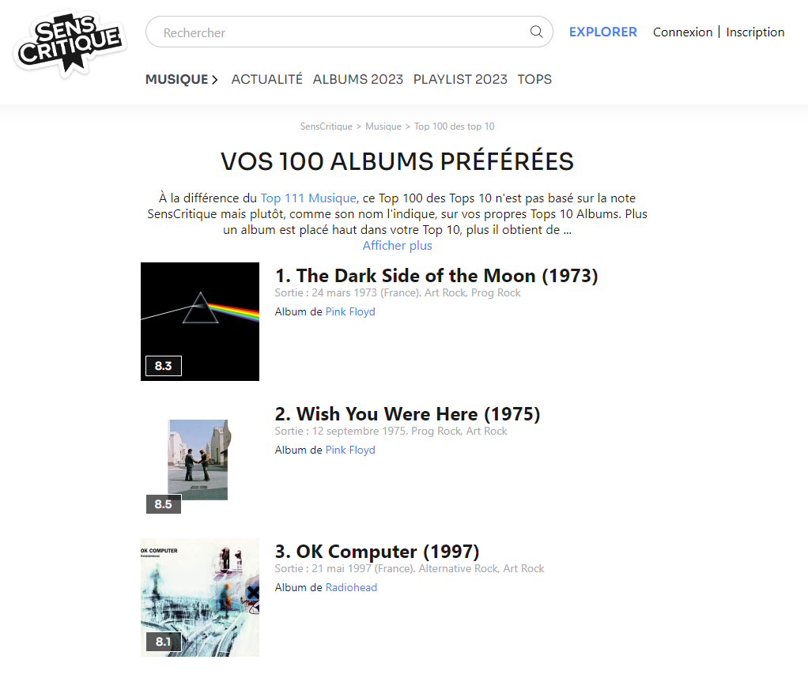
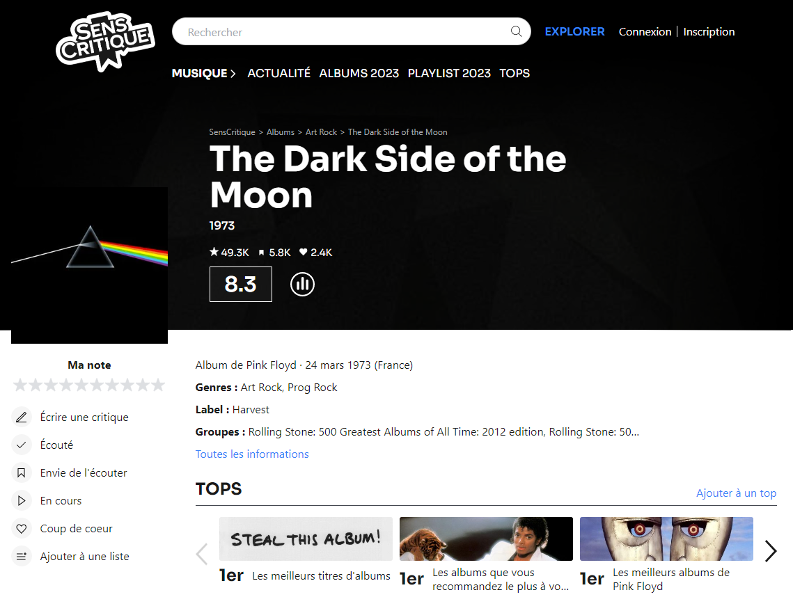
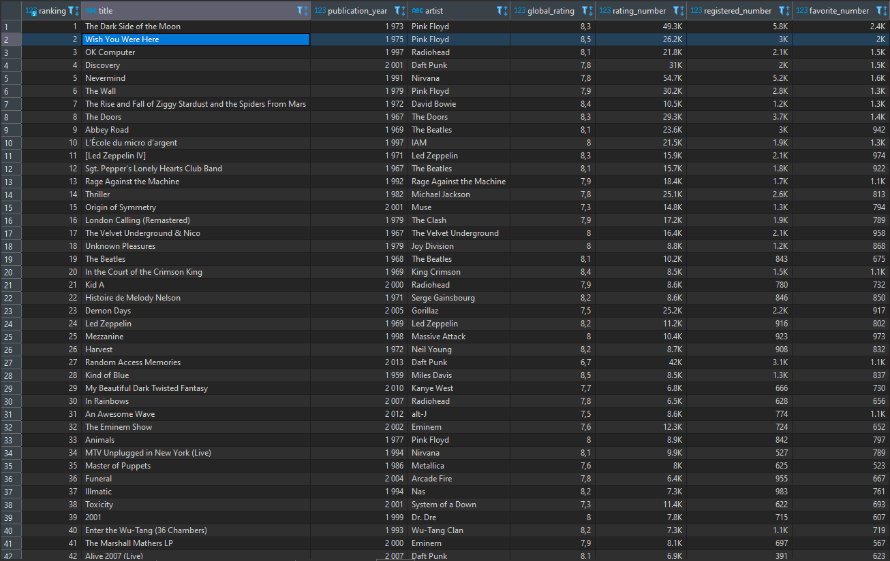

# WebScraping_SensCritique

Web Scraping data collection of the albums of _["Your 100 favorite albums" ranking](https://www.senscritique.com/livres/tops/top100-des-top10)_ on [SensCritique](https://www.senscritique.com/), and putting in relation with the opinions and criticisms of the Internet users.

  

# 1. Problematization

Our experiment aims to answer the following question: does the popularity of a cultural object correlate with its perceived quality? 

This question arises in many circles where it seems that the appreciation of the public and that of the critics can vary quite widely, as in cinema or music. But this feeling is common to all cultural fields. We therefore decided to collect data to see if this phenomenon is concrete and to analyze it if necessary.

To answer this, we decided to focus on music albums but we could also have chosen novels, comics, movies or even video games.

# 2. Context

We decided to do Web Scraping because all the data we needed is already on the Internet and it would have been difficult to ask people about their entire musical taste. A questionnaire would have been appropriate if we had wanted to focus on a few specific works, but in this case we would not have been able to observe trends in an entire cultural domain, which is the goal of our experiment.

We wanted to focus on the opinions and criticisms of a single country for our experiment in order to reduce cultural bias, as each culture has its own sensitivities, and the appreciation of works could vary according to the country, which is not what we are trying to measure. 

We did not choose an English-speaking review site because it would be impossible to reduce this potential bias, English being the reference language on the Internet. We therefore naturally turned to the most popular French-language review site : [SensCritique](https://www.senscritique.com/) (www.senscritique.com). A French-speaking site does not cancel out the cultural bias because many countries speak French, but it is less than the number of countries that speak English.

Senscritique is a site where users can rate and write reviews of movies, series, comics, music, books and video games. There are about 2 million unique users per month.

# 3. Design of Experiment (DoE)

We are seeking to compare both the rating of the albums with the Internet users reviews and their position in the user favorite albums global ranking to study the following hypothesis : **"The popularity of an album is proportional to its rating"**.

To do so, here are the elements we are collecting :

- **Population** : Music albums
- **Study sample** :  The 100 albums of the _"Your 100 favorite albums"_ ranking on SensCritique
- **Input characteristics** :
  - Album Title
  - Artist
  - Publication date
  - Genres
  - Number of ratings
  - Global Rating
  - "Favorite" mentions
  - "Want to listen" mentions
  - Number of commentaries

- **Output** : "Your 100 favorites albums" SensCritique ranking position

# 4. Data Collection

To gather data, we used **web-scraping** method on the _["Your 100 favorite albums" ranking](https://www.senscritique.com/livres/tops/top100-des-top10)_ page, and in each one of the SensCritique album page, where the Internet users opinions can be found.

1. ["Your 100 favorites albums" ranking](https://www.senscritique.com/livres/tops/top100-des-top10) on SensCritique page :

  

2. Individual album pages *(e.g., [Pink Floyd - The Dark Side of the Moon](https://www.senscritique.com/album/the_dark_side_of_the_moon/7848741))* :

  

# 5. Data Storage

In order to store the data collected through web scraping, we first exported the data in CSV format in order to verify the correct collection of data and the architecture of the generated dataset.

The data was then stored in a SQlite database which is a relational database. 
We chose to use this data management system rather than another one like MySQL because it requires less resources. It is not necessary for the moment to operate this database online, a local processing is enough, and the security that it is possible to have with MySQL like the management of users and permissions is not necessary for the project.
So, for its simplicity and efficiency, SQLite is more relevant for this project.
Here is a screenshot of the created database read by DBeaver :

  

